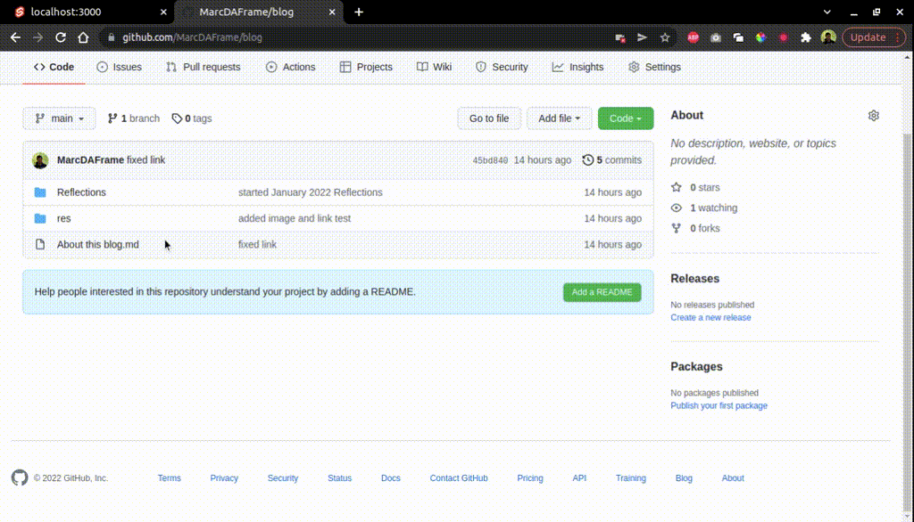

# Svelte Github Blog


## [More Info About This Blog](<https://mframe.ca/blog?file=About%20this%20blog.md>)

This is a minimum repo to show how to setup a blog using **Github** as your **CMS**

## Commands

```bash
# Create project
npm init svelte@next frontend

# install dependencies 
npm i

# Dev server
npm run dev
```


## Setup
- change the `src/constants.ts` file to your desired repo & branch
